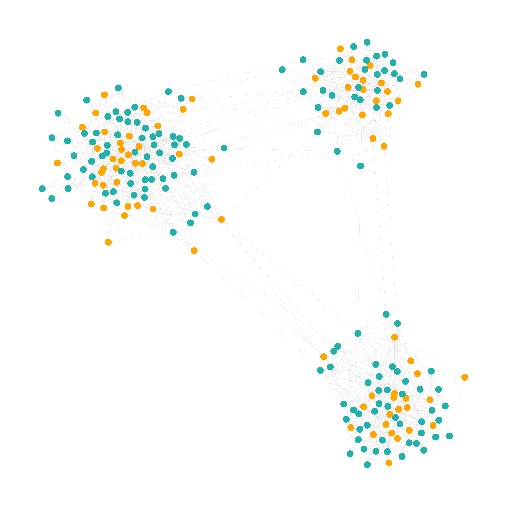
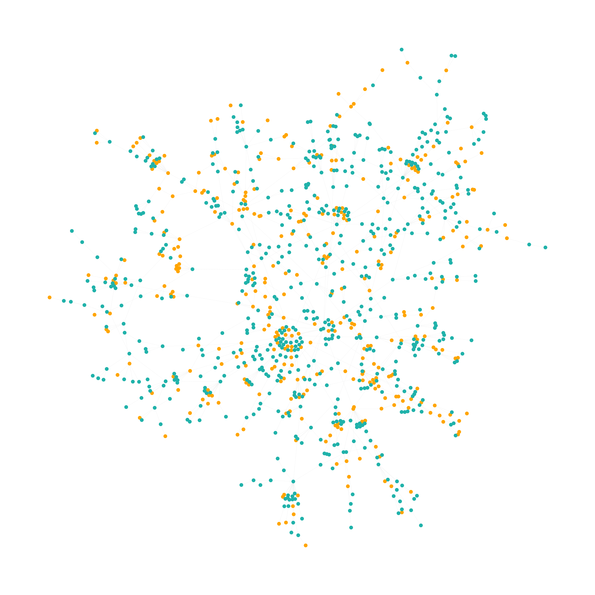

# epidemic-spreading-sim

## Description

A Graph theory study about the propagation of an epidemic. 

## Installation

The notebook `graph21-22.ipynb` is meant to be run with the julia jupyter kernel.
It is therefore required that you download julia from [julialang.org](https://julialang.org/downloads/) (or using the package manager of your choice). Once this is done, add julia to Jupyter Notebook. In a terminal type `julia`, which should be in your `PATH`, and run the following :

```julia
using Pkg
Pkg.add("IJulia")
```

You should now be able to open the notebook in jupyter, and run the cells individually.

## Examples




